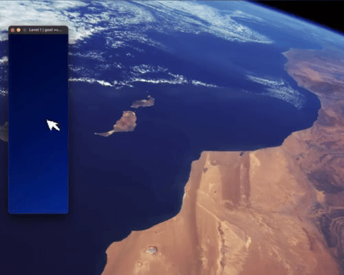
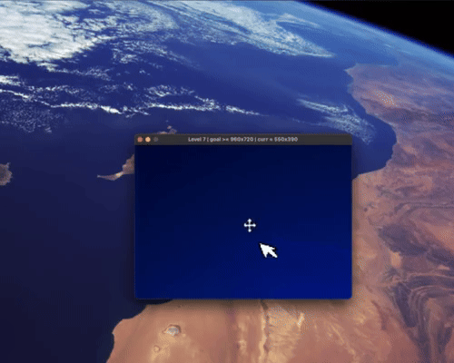

# Resize

## Use WASD to resize a window

This is an idea brought to life whilst reading the **SFML** tutorials and getting more familiar with it.

The idea was to create a game around resizing the window.





Whilst the idea is cool, the gameplay could be improved upon, a lot.

The game uses **SFML** and runs in **C++**. **Cmake** is used to download and link the **SFML** library.

## 📖 Topics
  - Game development
  - Dynamic window resizing

## 🛠️ Langs/Tools
  - C++
  - SFML
  - Cmake

## 🦉 Getting started

***Note that the game only works properly on MacOS as of now!***

You can head over to ***[Releases](https://github.com/kenlies/resize/releases)*** to grab the zip file. Just unzip and ***run*** the executable.

**OR**

You can **build** from source:

 1. If you're on Debian-based Linux distribution, you can use the following one-liner to install needed development libraries:

    ```
    sudo apt-get update && \
    sudo apt-get install \
    libxrandr-dev \
    libxcursor-dev \
    libudev-dev \
    libopenal-dev \
    libflac-dev \
    libvorbis-dev \
    libgl1-mesa-dev \
    libegl1-mesa-dev
    ```
2. If you don't have CMake, install it from ***[here](https://cmake.org/download/)*** or use the command line with your favourite package manager.
3. Go to the root of the repository and build using CMake:

   ```
   cmake -B build
   cmake --build build
   ```
4. If you are on Linux or Mac, set the appropriate executable permissions:

   ```
   chmod +x build/bin/resize
   ```
   
5. Run the executable:

   - Mac and Linux
     ```
     ./build/bin/resize
     ```
   - Windows

     ```
     build\bin\resize.exe
     ```

6. Enjoy!

## 🔨 To improve

As established earlier, the gameplay experience of the game could be improved. One simple way of doing that could just be to introduce a time element to each level.

Obviously, the code can definitely be made more efficient, readable and optimal.

Also the whole codebase basically resides in the **main.cpp** file, which is not ideal. Didn't really feel like using **OOP** for such a small game idea. Should have though.
