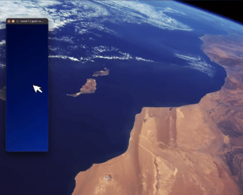
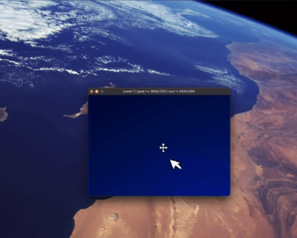

# Resize

## A game made in C++ with SFML

This is an idea brought to life whilst reading the **SFML** tutorials and getting more familiar with it.

The idea was to create a game around resizing the window.





## Getting started

***Note that this game only works properly on MacOS.***

You can head over to [Releases](https://github.com/kenlies/resize/releases) to grab the zip file. Just unzip and ***run*** the executable.

**OR**

You can **build** from source:

 1. If you're on Debian-based Linux distribution, you can use the following one-liner to install needed development libraries:

    ```
    sudo apt-get update && \
    sudo apt-get install \
    libxrandr-dev \
    libxcursor-dev \
    libudev-dev \
    libopenal-dev \
    libflac-dev \
    libvorbis-dev \
    libgl1-mesa-dev \
    libegl1-mesa-dev
    ```
2. If you don't have CMake, install it from [here](https://cmake.org/download/) or use the command line with your favourite package manager.
3. Go to the root of the repository and build using CMake:

   ```
   cmake -B build
   cmake --build build
   ```
4. Set the appropriate executable permissions:

   ```
   chmod +x build/bin/resize
   ```
   
5. Run the executable:

     ```
     ./build/bin/resize
     ```

7. Enjoy!
